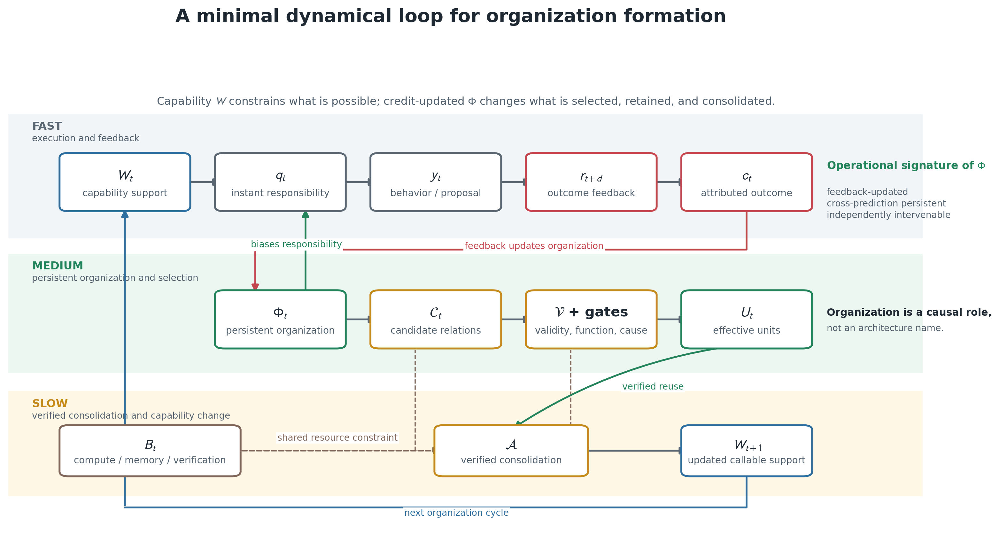
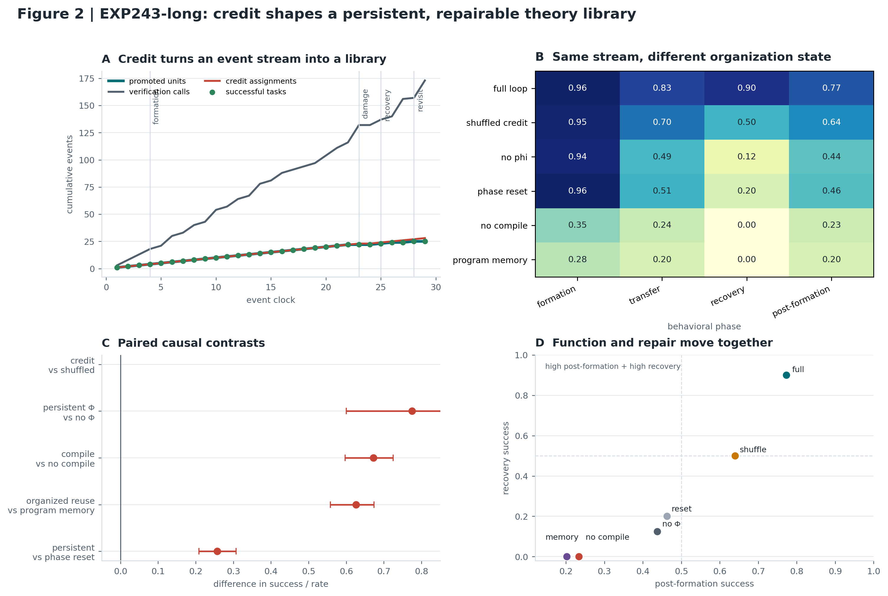
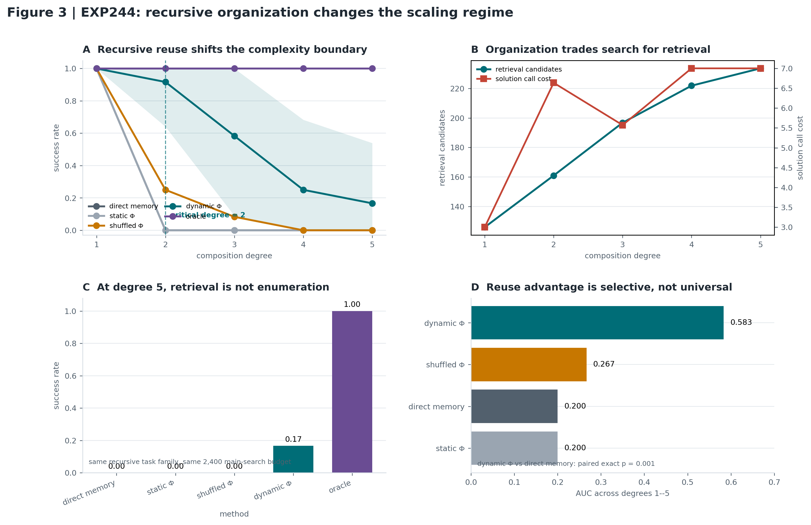
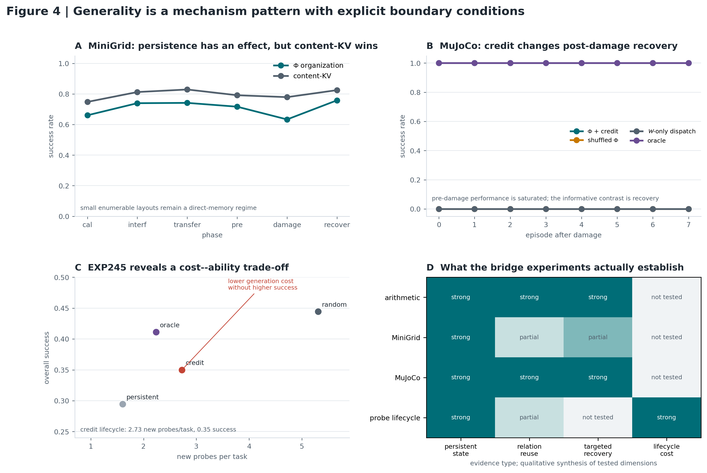

# Credit assignment creates persistent organization in adaptive computational systems

# 信用分配在适应性计算系统中形成持久组织

**期刊论文草稿 v0.9（Attention 与组织时间尺度修订版）**

## 摘要

学习通常被描述为参数更新，但有限资源下的适应还要求系统决定何时调用哪些已有能力。我们提出一个受约束组织原理：当当前观察不足以确定责任，而保存完整历史或重新搜索全部能力代价过高时，系统应把历史压缩为面向未来责任分配的持久状态 $\Phi$。在一个以形式算术为可审计动力学介质的连续系统中，我们用 20 个配对随机种子和 29 个连续任务检验了这一预测。打乱信用归属使总体成功率从 0.772 降至 0.660；移除 $\Phi$ 后降至 0.491。局部损坏后，$\Phi$ 将恢复率从 0.125 提升至 0.900；把已验证结构编译为可调用单元，则使复杂任务成功率从 0.033 提升至 0.706。复杂度扫描和跨域控制实验进一步表明，这种收益并不普遍存在：直接记忆在可枚举环境中更高效，而持久组织在关系复用、责任冲突和结构损坏成为瓶颈时显现。能力参数 $W$ 与组织状态 $\Phi$ 因而构成两个可分离、可干预并共同决定有效行为的动力学维度。

---

## 引言

设一个系统拥有两个固定模块 $A$ 和 $B$。两者都能完成同一种请求，但环境会暂时使其中一个失效，且当前输入不暴露故障位置。最近的反馈可能表明 $A$ 可靠而 $B$ 失效，也可能恰好相反。面对完全相同的请求，无状态系统只能作出相同选择；若两种情况等概率，它至少有一半概率把责任交给失效模块。保存完整事件史可以避免错误，却要求系统不断存储和搜索过去。真正需要保留的只有一位信息：现在由谁负责。

令 $\Phi=A$ 或 $B$ 表示当前可靠接口，系统便可在常数时间内完成路由。失败反馈通过信用改写这一状态；下一次输入即使不变，行为也会随 $\Phi$ 改变。冻结能力并干预 $\Phi$ 会翻转选择，而固定责任后，这一效应消失。这个思想实验揭示了本文的核心问题：一个系统如何把历史反馈压缩为持久的责任结构，并在未来重新调用它？

学习改变系统能够执行的映射，但适应还取决于这些映射如何被调用、组合和修复。大多数模型把二者共同写成

\[
y=F(x;W),
\tag{1}
\]

参数 $W$ 因而同时承担“系统具有什么能力”和“系统此刻如何组织能力”的解释。这个合并在静态任务中通常无害，在非平稳环境中却留下一个缺口：相同操作可以因历史反馈不同而形成不同调用关系，一次成功也可能由多个组件共同产生，而其中只有一部分真正负责。只观察 $W$ 和输出，无法分开能力、责任与组织。

我们把这三个层次展开为一个最小闭环：

\[
\boxed{
W_t\rightarrow q_t\rightarrow y_t\rightarrow c_t
\rightarrow\Phi_{t+1}\rightarrow U_t\rightarrow W_{t+1}.
}
\tag{2}
\]

$W$ 给出可执行能力的支持，$q$ 表示当前由谁负责，$c$ 把结果归因到具体责任接口，$\Phi$ 保存跨预测持续的组织状态，$U$ 则表示经验证后可以复用的有效单元。这个分解引入了一个独立的中时间尺度：反馈不必立即改写能力本身，而可以先改变组织，再由组织改变未来调用。



**图 1｜能力、责任与组织处于不同时间尺度。** 快速通道产生行为和反馈；在 Transformer 中，经因果干预验证的 attention map 可以实现这一层的瞬时责任 $q$。信用归属更新中时间尺度的组织状态，后者改变下一次责任选择。候选关系经有效性、功能和因果检验成为有效单元，并在共享资源约束下进入慢变能力支持。$\Phi$ 由反馈更新、跨预测持续和独立可干预性来识别，而不由某一种网络结构命名。

形式算术为这一闭环提供了少见的可观测性。符号原语对应能力，证明依赖显式呈现责任，反例和证明核提供反馈与有效性，定理库承载持久状态，有界搜索则引入真实的资源约束。于是，结构的生成、调用、损坏和恢复都可以被记录和干预。我们把形式算术视为一种一般性动力学介质，并不假定其他任务“像算术”；真正需要跨域保持的是状态转移与反事实干预。沿着这一思路，我们先建立一个单体长时程闭环，再逐步提高组合复杂度，并在离散和连续控制环境中检验其边界。结果揭示了一条一致规律：当关系需要反复复用，且局部结构可能失效时，正确的信用归属会把短暂反馈转化为可恢复、可组合的持久组织。

---

## 理论框架：受约束组织原理

系统状态写为 $\mathcal S_t=(x_t,W_t,\Phi_t,C_t,\mathcal V,B_t)$，其中 $C_t$ 表示候选结构，$\mathcal V$ 表示有效性接口，$B_t$ 表示计算、存储和维护预算。行为由责任分配连接能力与输出：

\[
q_t=R(x_t,W_t,\Phi_t),\qquad y_t=F(x_t;W_t,q_t).
\tag{3}
\]

设 $H_t$ 表示当前时刻以前的经验。如果两个历史 $h$ 和 $h'$ 具有相同的当前输入 $x_t$ 与能力支持 $W$，却要求不同的最优责任分配，那么无状态规则 $q=R(x,W)$ 不可能在两种情形下同时最优。系统只能重新搜索完整历史、保存并检索全部事件，或把历史压缩成未来责任所需的信息。前两种选择分别消耗计算和存储；第三种选择形成一个受约束的信息瓶颈：

\[
\min_{p(\phi\mid H),R}
\;\mathbb E[\mathcal L_{t:T}]
+\beta I(H_t;\Phi_t\mid X_t)
+\lambda\mathbb E[C_{\rm call}(R)]
+\rho\mathbb E[C_{\rm update}(\Phi)].
\tag{4}
\]

第一项保留对未来行为有用的历史差异，其余三项分别约束状态的信息率、调用搜索和维护成本 [3,4,16,17]。因此，$\Phi$ 不是任意附加变量，而是未来责任充分统计量的有损近似。若历史与最优责任无关，或编码和计算成本高于收益，最优 $\Phi$ 退化为常量；若无状态路由的不可约损失更大，则最优解必须满足 $I(H;\Phi\mid X)>0$。组织是否值得形成，由历史条件化带来的行为收益能否超过编码、检索和维护成本决定。补充材料证明了有限状态条件下最优解的存在性、非平凡性和最小充分性。

> **受约束组织原理。** 在能力支持固定、历史影响未来责任且信息与计算资源有限的系统中，持久组织状态是历史关于未来责任的最小任务相关压缩；它出现的条件是该压缩带来的行为收益严格超过编码、调用与维护成本。

开篇思想实验正是这一原理的最小实例。若当前输入已经暴露故障、环境不再回访，或一次性记忆比状态维护更便宜，$\Phi$ 应当退化；否则，一位责任状态就能替代不断增长的事件史。补充材料给出了该实例的精确损失与成本比较。

据此，一个状态只有满足四项操作性条件才被称为 $\Phi$：它独立于固定参数 $W$ 并可在冻结 $W$ 时更新；更新依赖反馈及其信用归属；更新结果跨预测持续；干预该状态会改变责任、路由、候选优先级或生命周期。若固定 $q_t$ 后 $\Phi$ 对行为的效应显著缩小，责任就是主要中介。KV、RNN 和图状态都可能实现这些功能，但“有状态”本身并不足以构成组织。

**与 Attention 的关系。** 在标准自注意力中，$Q/K/V$ 投影属于慢变参数 $W$，一次前向产生的 attention map 则是瞬时责任 $q_t$ 的候选实现：它根据当前内容分配 token 或特征的选择权重 [11]。但权重大小本身不等于因果责任；不同 attention map 可能产生相近输出，较大的权重也未必对应较大的干预效应 [18,19]。只有当 head、边或 map 的干预能够定向改变调用与行为，并且固定该责任变量后 $\Phi$ 的效应缩小时，attention 才能被操作性地解释为 $q_t$。$\Phi$ 位于 $W$ 与这一快速选择过程之间。它不替代 attention，而是把过去反馈形成的责任先验带入下一次注意力计算，例如

\[
A_t^{\Phi}
=\operatorname{softmax}\!\left(
\frac{Q_W(X_t)K_W(X_t)^\top}{\sqrt d}
+G(\Phi_t)
\right),
\tag{5}
\]

其中 $G(\Phi_t)$ 可以调制 attention logits、head、token、专家或更一般的路由关系。Attention 的优势在于快速、可微和细粒度的内容寻址，并能在一次上下文内并行组合大量关系；它是高效的即时责任分配器。标准 attention map 的不足则来自时间尺度：它在下一次前向时重新计算，通常不在反馈后独立更新，也不保存某个关系为何成功或失败。训练得到的 $Q/K/V$ 已进入 $W$；普通 KV cache 虽能延长内容可见期，却不自动获得责任信用、生命周期或损坏后的定向修复。

$\Phi$ 补足的是跨预测组织：它能够以有限状态压缩历史信用，保持关系偏好，并在局部失败后改变未来调用。代价是新增写入、维护和稳定性问题；错误信用会固化错误结构，过慢更新会造成陈旧，过快更新会引起振荡。在当前输入已经充分、长上下文检索足够便宜或环境不再回访时，Attention 或直接 KV memory 可能更有效。因此，我们把二者视为两个协同时间尺度：Attention 在当前上下文中计算 $q_t$，$\Phi$ 根据跨时段经验重塑未来 $q_t$ 的先验。

式 (4) 解释了组织状态为何可能出现，却不保证它必然获得语义、模块性或因果功能。候选必须同时满足有效性、功能保留、因果作用、生命周期稳定性和预算约束，才构成有效单元 $U$。当 $U$ 被编译为后续可调用对象时，固定推理预算下的可达行为才可能扩张；在此之前，$\Phi$ 只是重新组织已有能力。完整状态方程、条件命题与否证协议见 [Supplementary Information](补充材料_组织动力学完整数学与预测.md)。

---

## 实验设计

我们在三个层次检验这一原理。连续算术闭环（EXP243-long）检验信用、持久状态、巩固与恢复能否在同一状态谱系中共同运作；复杂度扫描（EXP244）寻找组织开始产生净收益的边界；探针生命周期、MiniGrid 和 MuJoCo 则检验成本与跨域适用范围。早期组件实验用于形成机制和参数假说，作为补充证据单独报告，不与确认性实验合并统计。

**表 1｜主实验参数、控制条件与结论范围。**

| 实验 | 环境与任务 | 重复与统计单位 | 关键预算和状态限制 | 主要干预 | 可支持的结论 |
|---|---|---|---|---|---|
| 连续算术闭环（EXP243-long） | 精确多项式域；29 个连续任务：4 个形成、16 个重复复用、3 个跨单元迁移、1 个冻结损坏审计、2 个恢复及 3 个后期任务 | 20 个配对种子；种子为统计单位；7 方法，共 4,060 条事件记录 | 每任务候选 2,400、核验 16、查询 8；资源初值/流入/上限为 130/30/180；候选档案上限 260；非基础活动单元上限 12 | shuffled credit、no-$\Phi$、no-compile、program memory、random verify、phase reset | 信用、持久性、编译和恢复在同一状态谱系中的因果作用 |
| 复杂度扫描（EXP244） | 次数 1--5 的递归复用族与同次数、同展开规模的低复用控制；展开规模 7/15/23/31/39 | 12 个配对种子；种子为统计单位；7 方法 | 主候选预算 600/1,200/2,400；共享原语、初始探针和精确规范形核；检索计算单独记账 | dynamic $\Phi$、static $\Phi$、shuffled credit、direct memory、flat search、oracle | 固定主搜索预算下的复杂度边界；不构成等总计算比较 |
| 探针生命周期（EXP245） | 15 个连续任务：5 个形成、5 个低复用转移、5 个回访 | 12 个配对种子 | 每任务候选 1,800；活动探针 4；查询上限 8 | reset、full persistence、random/credit/oracle lifecycle | 生命周期对生成成本和组织过拟合的影响 |
| MiniGrid | 6 个小规模任务族，包含形成、未见布局、干扰、损坏和恢复；108 episodes/种子 | 20 个配对种子 | $\Phi$、content-KV、FIFO-KV 均为 156 个动态浮点数 | 状态机制与半槽损坏 | 小规模可枚举环境中的状态效用与直接记忆边界 |
| MuJoCo | MetaWorld `reach-v1`；12 个匿名原语、6 个轴角色、留出双轴和三轴组合 | 5 个随机种子 | $\Phi$、Task-KV、recent state 均为 144 个动态浮点数；局部恢复 8 episodes | 正确信用、打乱信用、$W$-only、Task-KV、责任边强制回退 | 关系级责任修复及跨任务传播；不是自主技能发现 |

在连续算术闭环中，所有方法共享任务顺序、基础原语、候选语法、精确有效性核、初始探针和每任务预算。完整闭环与 shuffled-credit 对照使用相同搜索随机流，唯一差别是信用身份被独立打乱。其余消融分别移除持久组织调制、在阶段边界重置状态、禁止有效单元进入后续能力，或只保存完整已见程序而不提供可组合接口。29 个任务在同一状态中连续发生，因此统计单位是种子而不是任务。

主要效应以种子内配对差估计，并采用双侧精确符号置换检验；六项预设比较经 Holm 校正。95% 区间来自 10,000 次配对 bootstrap。所有失败轨迹和未触发生命周期事件的轨迹均保留。完整参数、指标和对照矩阵见补充材料。

---

## 结果

### 信用把局部反馈转化为持久结构



**图 2｜信用归属塑造可恢复的理论库。** **A，**一个代表性种子中的事件轨迹，用于展示时间顺序。**B，**20 个配对种子的阶段均值。**C，**六项预设因果比较的配对效应与 95% bootstrap 区间。**D，**后形成性能与损坏恢复共同区分完整闭环和各项消融。

连续算术实验在一个从不重置的状态谱系中依次经历候选生成、主动查询、信用归属、精确核验、结构晋升、调用、定向损坏和反馈恢复。完整闭环的总体成功率为 0.772，形成、迁移和恢复阶段分别达到 0.960、0.829 和 0.900。若在阶段边界重置组织状态，总体成功率降至 0.516；配对差为 0.257（95% CI，[0.209, 0.307]；Holm 校正 $p=1.14\times10^{-5}$）。跨阶段持续本身由此成为行为的一部分。

随后，我们只改变反馈被归给谁，同时保持反馈量、任务和搜索随机流不变。正确信用使系统平均晋升 22.40 个单元，打乱信用时为 19.15，配对差为 3.25（95% CI，[2.15, 4.30]；Holm 校正 $p=1.37\times10^{-4}$）。后形成成功率相差 0.133（95% CI，[0.090, 0.177]）。两种系统在初始形成阶段几乎相同，差距却随重复复用持续扩大。信用改变的不是反馈数量，而是经验被写入哪一条关系。

### 持久组织使系统恢复并复用结构

我们接着损坏一个高责任单元。完整闭环在恢复阶段达到 0.900 的成功率；移除 $\Phi$ 后仅为 0.125，配对差为 0.775（95% CI，[0.600, 0.925]；Holm 校正 $p=4.58\times10^{-5}$）。持久状态保存的因而不是最近一次输出，而是能够重新分配责任的关系信息。

恢复并不是闭环的唯一结果。允许核验后的有效单元进入后续能力后，复杂任务成功率达到 0.706；禁止编译时仅为 0.033，配对差为 0.672（95% CI，[0.597, 0.725]；Holm 校正 $p=1.14\times10^{-5}$）。在未见组合上，完整闭环达到 0.829，而整程序记忆为 0.203，差值为 0.626（95% CI，[0.558, 0.674]）。可组合巩固由此超越了整程序回放；更强的可组合 KV 和学习型循环状态仍构成开放比较。

闭环是稳定出现的，但并非无条件发生。20 条完整轨迹中有 3 条没有同时经历全部生命周期事件，因而满足了 10 项预设运行判据中的 9 项。所有 140 条方法—种子轨迹和 4,060 条事件均纳入分析。当前系统在给定候选语言和精确有效性核后形成组织；语法和真值接口本身尚未由系统生成。

### 组织收益随递归复用压力出现



**图 3｜递归组织改变固定主搜索预算下的复杂度边界。** **A，**动态组织状态在 12 个配对种子上的成功曲线；阴影表示种子间离散程度。**B，**关系检索成本与最终调用成本的权衡。**C，**五次组合上的方法比较。**D，**优势集中在递归复用族，而不出现在同阶低复用控制中。

在每任务 2,400 个主搜索候选下，平面主动搜索、直接记忆和静态宏只能连续解到一次关系。动态 $\Phi$ 在次数 1--5 上的成功率依次为 1.000、0.917、0.583、0.250 和 0.167，把连续边界推进到二次关系。其跨次数成功 AUC 为 0.583，而直接记忆和静态宏均为 0.200（双侧精确配对置换，均为 $p=9.77\times10^{-4}$）；相对打乱信用的 AUC 差为 0.317（$p=0.0273$）。

这一优势只出现在可复用关系中：当多项式次数和展开规模保持不变、递归复用被移除时，收益随之消失。检索成功与任务成功的相关为 0.736，显示瓶颈已从底层表达转向关系检索。这正是式 (4) 预期的区域：递归深度提高了历史压缩的未来收益，低复用控制则没有。动态 $\Phi$ 同时增加了相当于主预算 5.3%--9.7% 的检索评分计算；图 3 因而刻画的是等主搜索预算下的边界移动，而非等总计算优势。

### 跨域实验揭示组织何时值得维护



**图 4｜跨域实验揭示机制及其边界。** **A，**等动态状态预算下的 MiniGrid 表现。**B，**MuJoCo 定向损坏后的责任恢复。**C，**探针生命周期的生成成本与成功率。**D，**各实验对四项预设机制判据的证据状态；判据见补充材料，矩阵不表示统一性能排名。

MiniGrid 位于直接记忆更有利的一侧。$\Phi$ 的总体成功率、未见布局迁移和平均恢复时间分别为 0.712、0.783 和 2.15 episodes；使用相同 156 个动态浮点数的 content-KV 分别达到 0.797、0.850 和 1.65。首帧线索足以直接寻址完整策略，使小规模状态空间中的历史压缩收益不足以抵偿组织成本。尽管如此，$\Phi$ 仍跨 episode 持续、受反馈更新，并在损坏后产生可测行为变化。

MuJoCo 则引入了跨任务共享关系。负责 $x^+$ 的原语受损后，正确信用把责任转移到冗余原语；关闭更新后，这一修复仍在共享 $x^+$ 的新组合上保持 1.000 的成功率。同状态预算的 Task-KV 为 0.238，打乱信用和仅含 $W$ 的系统均为 0。将修复后的责任边强制指回受损原语，成功率再次降为 0。修复传播的是关系级责任，而不是单个任务记录；不过轴角色、冗余原语和组合接口在当前实验中仍由设计者提供。

生命周期实验分离了组织成本与任务能力。信用驱动的生命周期把回访阶段每任务新探针数从随机重置的 4.87 降至 2.27，却没有提高回访成功率（0.450 对 0.583；总体差异 $p=0.180$）。完全持久化的表现更差。持久结构可以节省生成成本，也可能对局部信息拓扑过拟合；稳定组织因此必须保留更新与退出通道。

---

## 从内容记忆到关系组织

这些干预依据功能而非实现材料识别了 $\Phi$。整程序记忆能够回放已见解，却不能产生同等的未见组合迁移；精确核能够拒绝错误候选，却不能决定有限预算下应先核验和保留什么；压缩能够减少条目，却不保证保留功能。中等规模的依赖闭合基优于完整库和过度压缩库，而长期占满活动槽位的探针反而降低适应性。组织由此表现为对关系、责任和生命周期的选择，而不只是内容存储量的变化。

$\Phi$ 在这些系统中保存关系级信用，调制候选和已巩固单元的调用优先级，在损坏后维持替代路径，并在共享预算下控制活动、归档和恢复。信用回答的是“结果应归属于谁”，而不是结果本身有多好或多坏。打乱信用保持了反馈总量，却改变了结构晋升和长期行为；正是这种责任特异性，使反馈成为组织动力学的驱动力。

---

## 讨论

这些结果把组织从架构隐喻变成了可测的动力学对象。形式算术提供精确有效性、显式依赖、可重复损坏和可量化搜索成本，使原本隐含的责任与组织状态能够被直接干预。离散和连续控制中的桥接实验随后复现了其中一部分因果关系。跨域保持的不是符号或任务语义，而是“历史压缩—责任选择—信用更新—结构巩固—损坏恢复”这一转移结构。

从这一视角看，Transformer 已经提供了强大的快速组织机制：self-attention 能在当前上下文中发现依赖、绑定变量并组合关系。它的盲点不是表达力不足，而是标准 attention map 缺少反馈后的独立持久性。$\Phi$ 为此增加一个较慢的状态轴，使过去的成功、失败和损坏能够改变未来 attention 的先验。反过来，$\Phi$ 也不能替代 Attention 的细粒度内容匹配，其能力上限仍由 $W$ 中已有的表示和算子决定。二者的结合把“当前应该关注什么”和“过去证明哪些关系值得继续关注”分配给不同时间尺度。

组织状态并不与 RNN、KV memory 或动态路由器按实现材料互斥。这些机制若由责任信用更新、跨预测持续并直接控制后续调用，都可能承载 $\Phi$。关键区别在于可检验的因果角色：内容是否只是被保存，还是已经改变关系责任；状态是否只影响当前激活，还是跨时间组织后续行为；结构是否只通过验证，还是获得了可维护的功能价值。这一坐标解释了直接记忆为何在可枚举环境中胜出，也预测组织收益将随组合复用、局部损坏、长期切换和容量压力增强。

目前，候选语法、精确有效性核和部分生命周期规则仍由实验者提供；复杂度实验也只匹配了主搜索预算，而未匹配总计算量。跨域实验复现了责任修复，却尚未在同一自然环境中闭合候选生成、信用、巩固、损坏和恢复的全部过程。下一步的决定性检验，是在相同状态、训练和总计算预算下比较可学习 GRU、可组合 content-KV 与依赖图检索，并在一个长时程自然任务中复现完整干预链。这样的实验将判断受约束组织原理能否从给定元接口的系统扩展到开放环境中的自主组织。

---

## 组织是适应的独立维度

在长时程责任竞争中，信用归属形成了一个独立于固定能力参数的持久状态。它不必创造新的底层操作，却能决定哪些操作承担责任、哪些关系被巩固，以及系统如何在损坏后恢复。当经过验证的有效单元进一步进入能力支持时，组织还会扩张固定推理预算下的可达行为。

适应性系统因而沿两个协同维度变化：$W$ 描述可执行能力，$\Phi$ 描述这些能力如何被组织。组织不是记忆的普遍替代，而是在关系复用和结构修复成为瓶颈时出现的受约束解。把这一状态显式化，使模块形成、责任重分配和可维护适应成为可以测量、干预和证伪的科学问题。

---

## 方法与统计摘要

连续算术闭环的事件流、预算、方法和六项主比较均在正式运行前确定。20 个种子按方法配对；先导运行仅用于修复候选档案污染和随机流混杂，不进入正式分析。主要比较采用双侧精确符号置换、Holm 多重比较校正和 10,000 次配对 bootstrap。复杂度和生命周期实验同样以种子为配对单位。MiniGrid 的损坏细分属于事后探索；MuJoCo 的 5 个种子只用于复核大效应机制，不用于小效应性能排序。完整配置、指标定义、图 4D 判据和失败处理见补充材料。

## 数据与复现

核心运行脚本为 `exp243_long_closed_loop.py`、`exp244_complexity_scaling.py` 和 `exp245_probe_lifecycle.py`；正式结果位于 `results/EXP243_long_closed_loop.json`、`results/EXP243_long_analysis.json`、`results/EXP244_complexity_scaling.json`、`results/EXP244_complexity_analysis.json` 和 `results/EXP245_probe_lifecycle.json`。MiniGrid 与 MuJoCo 的配置分别见 `EXP120_MiniGrid持久组织状态实验报告.md` 和 `EXP166_机器人技能组合损坏与跨任务复用实验报告.md`。图 1 由 `plot_organization_loop_overview.py` 生成，图 2--4 由 `plot_science_figures.py` 从原始 JSON 重建。

EXP243-long 默认复现命令为：

```powershell
powershell -ExecutionPolicy Bypass -File .\run_exp243_long.ps1
```

该命令运行 20 个配对种子、29 个事件任务、7 种方法、每任务 2,400 个候选、16 次核验、8 次查询和 4 个并行 worker。并行数只影响墙钟时间，不改变随机流或统计单位。

## 参考文献

[1] Shannon, C. E. A Mathematical Theory of Communication. *Bell System Technical Journal* (1948).

[2] Watanabe, S. Information Theoretical Analysis of Multivariate Correlation. *IBM Journal of Research and Development* (1960).

[3] Rissanen, J. Modeling by Shortest Data Description. *Automatica* 14, 465--471 (1978).

[4] Tishby, N., Pereira, F. C. & Bialek, W. The Information Bottleneck Method (1999).

[5] Sutton, R. S., Precup, D. & Singh, S. Between MDPs and Semi-MDPs: A Framework for Temporal Abstraction in Reinforcement Learning. *Artificial Intelligence* 112, 181--211 (1999).

[6] Pearl, J. *Causality: Models, Reasoning, and Inference*. Cambridge University Press (2009).

[7] Hoel, E. P., Albantakis, L. & Tononi, G. Quantifying Causal Emergence Shows That Macro Can Beat Micro. *PNAS* 110, 19790--19795 (2013).

[8] Muggleton, S. Inductive Logic Programming. *New Generation Computing* 8, 295--318 (1991).

[9] Colton, S. *Automated Theory Formation in Pure Mathematics*. Springer (2002).

[10] de Moura, L. & Ullrich, S. The Lean 4 Theorem Prover and Programming Language. *CADE* (2021).

[11] Vaswani, A. et al. Attention Is All You Need. *NeurIPS* (2017).

[12] Shazeer, N. et al. Outrageously Large Neural Networks: The Sparsely-Gated Mixture-of-Experts Layer. *ICLR* (2017).

[13] Kingma, D. P. & Ba, J. Adam: A Method for Stochastic Optimization. *ICLR* (2015).

[14] Graves, A., Wayne, G. & Danihelka, I. Neural Turing Machines. arXiv:1410.5401 (2014).

[15] Hochreiter, S. & Schmidhuber, J. Long Short-Term Memory. *Neural Computation* 9, 1735--1780 (1997).

[16] Simon, H. A. A Behavioral Model of Rational Choice. *Quarterly Journal of Economics* 69, 99--118 (1955).

[17] Ortega, P. A. & Braun, D. A. Thermodynamics as a theory of decision-making with information-processing costs. *Proceedings of the Royal Society A* 469, 20120683 (2013).

[18] Jain, S. & Wallace, B. C. Attention is not Explanation. *NAACL-HLT*, 3543--3556 (2019).

[19] Serrano, S. & Smith, N. A. Is Attention Interpretable? *ACL*, 2931--2951 (2019).
